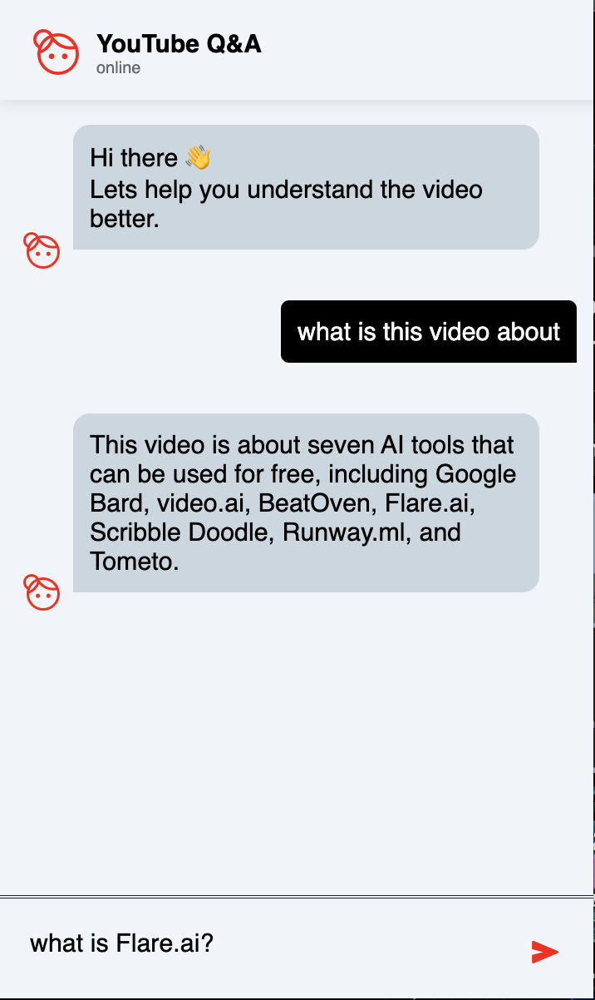
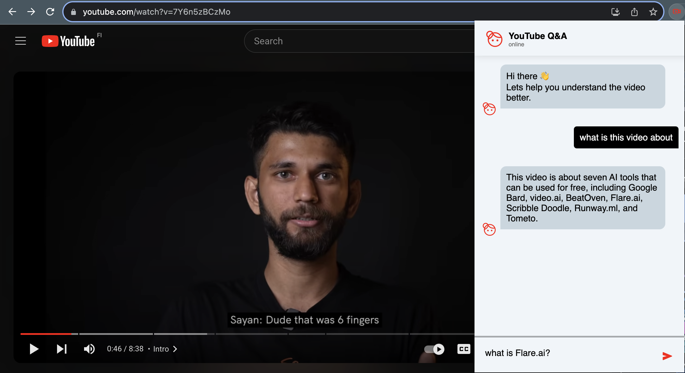

# Youtube Q&A

## Overview
Welcome to the GitHub repository for our YouTube Q&A Chrome Extension! This extension enhances the YouTube video viewing experience by providing a streamlined way to ask and answer questions related to video content.

## Features
- **Ask Questions:** Easily pose questions about the video content you're watching.
- **Get Realted Answers:** This extension connect to ChatGPT and provide answers for you.

<p align="center">
  
</p>


## Installation
1. Clone the repository: `git clone https://github.com/narsan/YoutubeQ-A.git`
2. Install prerequisite libraries by running ```npm install```
3. Replace your own API KEYS in ```config.json```:
   
    ```
    {
    "OPENAI_API_KEY": "Paste your openAI API key here",
    "YOUTUBE_API_KEY" : "Paste your RapidAI Youtube Captions and Transcripts API here" 
    }
    ```
    RapidAI offers 25 free request per months that you can subscribe and use [here](https://pages.github.com/](https://rapidapi.com/dashdash/api/youtube-captions-and-transcripts)https://rapidapi.com/dashdash/api/youtube-captions-and-transcripts).
     
4. Open Chrome and navigate to `chrome://extensions/`
5. Enable "Developer mode" in the top right corner
6. Click "Load unpacked" and select the extension folder from the cloned repository

   
## Usage
1. Open a YouTube video in Chrome.
2. Use the extension interface to ask questions.
   

## Support
If you have any questions or encounter issues, feel free to [create an issue](https://github.com//narsan/YoutubeQ-A/issues) on GitHub.

Happy questioning :)


<p align="center">
  
</p>


